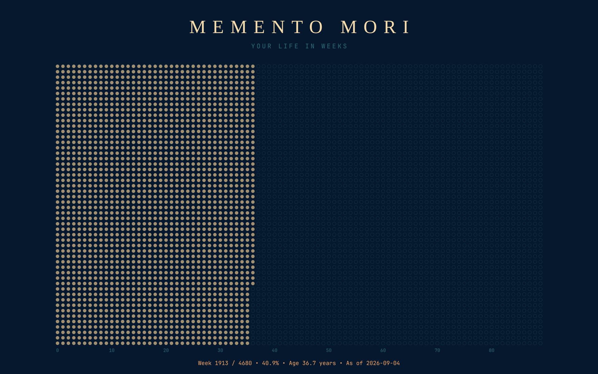

# memento mori wallpaper

A "life in weeks" desktop wallpaper for [Omarchy](https://omarchy.org/) / Hyprland.
Every week of your (assumed) lifespan is a dot — filled once you've lived it.
Colors follow your active Omarchy theme automatically.



## Features

- Wallpaper regenerates weekly via a systemd user timer
- Colors match your current Omarchy theme, refreshed automatically on theme change
- `memento-mori-settings` — interactive menu to change birth date / life expectancy
- Clean uninstall

## Requirements

- [Omarchy](https://omarchy.org/) (Hyprland + `omarchy-theme-bg-set`)
- `rsvg-convert`, `gum`, `python3` (all present on a stock Omarchy install)

## Install

```bash
git clone https://github.com/doitn0w/memento-mori-wallpaper.git
cd memento-mori-wallpaper
./install.sh
```

The installer copies the scripts to `~/.local/bin`, writes a starter config to
`~/.config/memento-mori/config.toml`, enables the weekly systemd timer, and
registers an Omarchy `theme-set` hook so the wallpaper refreshes instantly
whenever you switch themes.

After installing, set your birth date and life expectancy:

```bash
memento-mori-settings
```

## Usage

```bash
memento-mori-wallpaper   # regenerate and apply immediately
memento-mori-settings    # change birth date / lifespan interactively
```

## Uninstall

```bash
./uninstall.sh
```

Removes the timer, the theme-change hook, the scripts, and all generated
config/state. Run `omarchy theme bg switcher` afterwards to pick a new
background.

## How it works

- `bin/memento-mori-wallpaper` builds an SVG grid (years × weeks-per-year),
  fills in the weeks you've lived, rasterizes it with `rsvg-convert` at your
  monitor's resolution, and sets it via `omarchy-theme-bg-set`.
- Colors are read live from `~/.local/state/omarchy/current/theme/colors.toml`.
- A new timestamped file is written on every run (Omarchy's background
  plugin ignores a re-set of the same path), and older files are cleaned up
  automatically.

## License

MIT — see [LICENSE](LICENSE).
